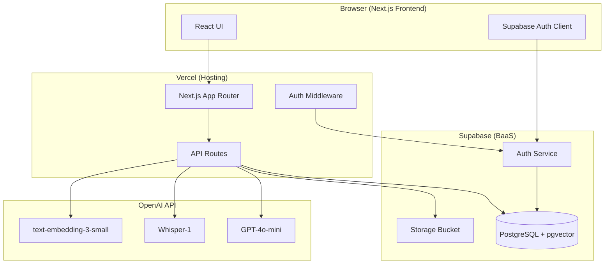
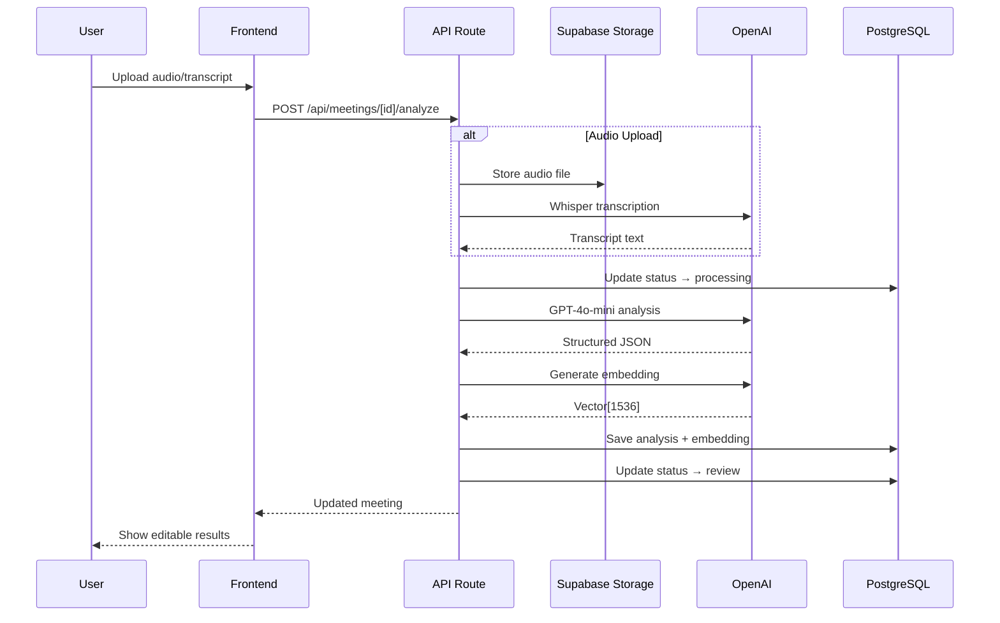

# Technical Architecture

## System Overview



## Layer Breakdown

### Frontend
- **Framework:** Next.js 15 with App Router
- **UI:** React 19, Tailwind CSS 4, Lucide icons
- **State:** React useState/useEffect (no external state library needed for MVP)
- **Pages:** Login, Dashboard, New Meeting, Meeting Detail, Search, Chat

### Backend
- **Runtime:** Next.js API Routes (serverless on Vercel)
- **Endpoints:**
  - `GET/POST /api/meetings` — List/create meetings
  - `GET/PATCH/DELETE /api/meetings/[id]` — CRUD single meeting
  - `POST /api/meetings/[id]/analyze` — Upload + AI analysis
  - `POST /api/meetings/[id]/follow-up` — Generate follow-up email
  - `GET /api/search` — Text + semantic search
  - `POST /api/chat` — Conversational Q&A

### AI Layer
- **Transcription:** OpenAI Whisper-1 for audio files
- **Analysis:** GPT-4o-mini with JSON mode for structured extraction
- **Embeddings:** text-embedding-3-small for semantic search
- **Q&A:** GPT-4o-mini with meeting context injection
- **Email:** GPT-4o-mini for follow-up email generation

### Authentication
- Supabase Auth with email/password
- Session managed via cookies (SSR-compatible)
- Middleware refreshes session on each request
- Row Level Security enforces data isolation

### Database
- **Engine:** PostgreSQL (Supabase)
- **Extensions:** pgvector for embedding similarity search
- **Tables:** `meetings` (single table MVP)
- **RLS:** Users can only access their own meetings
- **Functions:** `search_meetings()` (vector), `text_search_meetings()` (full-text)

### Storage
- Supabase Storage bucket `meeting-audio`
- Path pattern: `{user_id}/{meeting_id}.{ext}`
- RLS policies restrict access to file owner

### External Services
| Service | Purpose |
|---------|---------|
| Supabase | Database, Auth, Storage |
| OpenAI | Transcription, Analysis, Embeddings, Q&A |
| Vercel | Hosting, Serverless Functions |

### Deployment

```
Developer → Git Push → GitHub → Vercel (auto-deploy)
                                    ↓
                              Environment Variables
                                    ↓
                         Supabase + OpenAI (connected)
```

**Vercel Configuration:**
- Framework preset: Next.js
- Environment variables set in Vercel dashboard
- Serverless function timeout: 60s (for AI analysis)

## Data Flow: Meeting Analysis



## Security

- All API routes verify authenticated user
- Database RLS prevents cross-user data access
- Storage policies restrict file access to owner
- OpenAI API key server-side only (never exposed to client)
- Input validation on all endpoints
- Transcript truncated to 100K chars to prevent abuse
